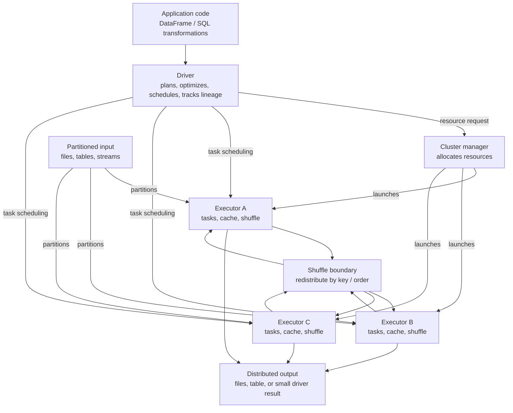

# Module 01 Review Pack: Spark Architecture

Use this as a fast review after completing Module 01. The goal is not to
memorize isolated definitions. The goal is to explain how Spark turns a data
problem into distributed work, predict where problems appear, and choose Spark
only when its coordination costs are justified.

## Key concepts

### Why Spark exists

Spark exists to coordinate distributed data processing. The hard part is not
writing a filter, join, or aggregation. The hard part is splitting work across
machines, scheduling tasks, moving data when required, retrying failed work,
and combining results correctly.

Use Spark when data volume, elapsed time, throughput, complex intermediates,
or failure recovery needs exceed what a simpler single-machine or database
solution can handle comfortably. Do not use it just because the data feels
"big" or because a cluster is available.

Snappy version:

> Spark is a distributed computation engine. It helps when parallel execution
> and recoverability are worth the overhead of cluster coordination.

### PostgreSQL, pandas, and Spark

PostgreSQL is best when durable relational storage, indexed access,
transactions, and concurrent serving matter. pandas is best for local,
interactive analysis when the working set fits on one machine. Spark is best
for repeatable bulk transformations that benefit from cluster parallelism and
distributed recovery.

The mature question is:

> What constraint requires distribution: memory, runtime, throughput, recovery,
> or transformation complexity?

### Driver and executors

The driver is the control plane for one Spark application. It creates the
session, builds plans, requests resources, schedules tasks, tracks progress,
and receives small results from actions.

Executors are application-specific worker processes. They run tasks over
partitions, cache data, write and read shuffle files, spill when needed, and
report status to the driver.

The cluster manager allocates resources. It does not replace the Spark driver.

### Partitions and tasks

A partition is Spark's logical chunk of distributed data. Within a stage, one
partition usually becomes one task. Partition count controls available
parallelism. Partition size and skew control task memory pressure and runtime.

Too few partitions underuse the cluster. Too many tiny partitions increase
scheduling, metadata, and file overhead. Uneven partitions cause stragglers.

### Lazy evaluation

Transformations such as `select`, `filter`, and `join` build a plan. Actions
such as `count`, `collect`, `show`, and `write` trigger execution.

Laziness lets Spark optimize the whole plan through column pruning, predicate
pushdown, operator simplification, and physical strategy selection. It also
means separate actions may recompute the same lineage unless the result is
persisted or materialized deliberately.

### DAGs, jobs, stages, and shuffles

Spark models dependencies as a DAG. When an action runs, Spark creates one or
more jobs. Jobs are split into stages, usually at shuffle boundaries. Stages
contain tasks, and tasks usually operate on partitions.

Narrow transformations can often be pipelined in one stage. Wide
transformations such as joins, `groupBy`, `distinct`, and global sorts often
need a shuffle, which means serialization, network I/O, disk spill, and
coordination.

### When not to use Spark

Avoid Spark for low-latency transactional serving, small data that fits
comfortably on one machine, tiny per-file jobs, workloads dominated by
external side effects, and jobs already meeting their SLA on simpler
infrastructure.

Strong Spark judgment includes knowing when PostgreSQL, pandas, DuckDB, an
analytical warehouse, or a simple service is the better tool.

## Essential Spark architecture diagram

Read the diagram like this:

1. Your code describes a result.
2. The driver turns the description into optimized distributed work.
3. The cluster manager grants resources.
4. Executors run tasks over partitions.
5. Narrow work stays local; wide work creates shuffles.
6. Output should usually remain distributed unless the result is genuinely
   small.

## Common debugging problems playbook

### Driver out of memory

Likely causes:

- `collect()` or `toPandas()` pulled too much data to the driver.
- A huge generated plan overloaded driver planning memory.
- Too many tiny partitions created excessive scheduling metadata.
- Large broadcast variables pressured the driver.

Inspect:

- Driver logs and heap errors.
- Recent actions that return data locally.
- Physical plan size and number of tasks.
- Use of `collect`, `toPandas`, `show` on unbounded data, or large local lists.

Fix:

- Keep large results distributed and write them to storage.
- Use `limit`, sampling, or aggregate summaries for inspection.
- Materialize intermediate tables instead of building enormous plans.
- Reduce tiny partition counts or compact tiny files.

Interview line:

> Free executor memory does not save the driver. The driver has its own memory
> limit, and `collect()` moves distributed data into that one process.

### One task is much slower than the rest

Likely causes:

- Skewed key sent many records to one partition.
- One input partition is much larger than others.
- One task spills heavily while others do not.

Inspect:

- Spark UI task-duration distribution.
- Shuffle read size per task.
- Spill metrics.
- Key-frequency distribution.
- Largest partition size, not only average size.

Fix:

- Filter invalid heavy keys when semantically correct.
- Pre-aggregate before the shuffle.
- Salt hot keys and combine later.
- Broadcast a small join side when appropriate.
- Enable or tune adaptive skew handling.

Interview line:

> More executors may not help one oversized task. First I would prove whether
> the bottleneck is skew by comparing per-task input, shuffle, spill, and key
> distribution.

### Many cores are available but only a few tasks run

Likely causes:

- Too few input partitions.
- A previous `coalesce` reduced parallelism.
- A stage after a shuffle has too few shuffle partitions.
- The source cannot split the data effectively.

Inspect:

- Number of tasks in the active stage.
- Input file layout and splits.
- `spark.sql.shuffle.partitions`.
- Physical plan for `coalesce`, `repartition`, or exchanges.

Fix:

- Increase partitions when the SLA requires more parallelism.
- Use `repartition` when rebalancing is needed.
- Avoid large production `coalesce(1)`.
- Compact small files into healthy file sizes instead of relying on many tiny
  inputs.

Interview line:

> Parallelism is bounded by task count. If a stage has 20 tasks, 500 cores
> cannot make those 20 tasks run as 500 tasks.

### A count made the pipeline much slower

Likely causes:

- `count()` is an action and triggered the full upstream lineage.
- The later `write()` triggered the same lineage again.
- The counted DataFrame was assigned to a variable but not cached or
  materialized.

Inspect:

- Number of jobs triggered by the application.
- Repeated scans, joins, or shuffles in the Spark UI.
- Whether the counted result is reused.

Fix:

- Remove diagnostic counts from large production paths.
- Compute metrics as part of the main workflow when possible.
- Persist only when repeated reuse justifies memory or disk cost.
- Write a durable intermediate if restartability and auditability matter.

Interview line:

> A DataFrame variable is a plan, not stored rows. Two actions can run the same
> expensive plan twice unless I deliberately persist or materialize it.

### Executors fail or disappear

Likely causes:

- Executor memory overhead exceeded container limits.
- Skewed task created a giant hash table or sort.
- Too many concurrent tasks competed for executor memory.
- Python worker or UDF overhead was underestimated.
- Cached data crowded execution memory.

Inspect:

- Executor logs, container exit reason, and memory-overhead errors.
- Spill metrics and task failure patterns.
- Cores per executor and concurrent task count.
- Whether failures concentrate on one stage or one key.

Fix:

- Reduce skew or repartition before raising resources blindly.
- Lower cores per executor if concurrent memory pressure is the issue.
- Increase executor memory or overhead only when diagnosis supports it.
- Avoid caching large data without a clear reuse window.

Interview line:

> I would first locate whether the failure is per-task, per-executor, or
> cluster-wide. Adding memory is sometimes right, but skew or concurrency can
> make it the wrong first fix.

### Lost shuffle files cause recomputation

Likely causes:

- An executor that held shuffle output died.
- Downstream stages needed blocks from that executor.

Inspect:

- Fetch failure messages.
- Stage retries.
- Executor loss around shuffle-heavy stages.

Fix:

- Let Spark retry when the issue is transient.
- Improve executor stability if losses repeat.
- Reduce shuffle volume through filtering, projection, better join strategy,
  or pre-aggregation.
- Consider durable boundaries for very expensive or fragile lineages.

Interview line:

> Executor loss is often recoverable, but if lost shuffle blocks lived on that
> executor, Spark may need to recompute upstream work to recreate them.

### Too many small files

Likely causes:

- Input arrived as tiny files.
- Writes created one file per task across many small partitions.
- Frequent micro-batches produced fragmented output.

Inspect:

- File counts and average file size.
- Planning and listing time.
- Number of output tasks.
- Table layout and partition columns.

Fix:

- Compact files.
- Tune write partitioning.
- Avoid over-partitioned outputs.
- Batch tiny inputs before heavy Spark processing.

Interview line:

> Same bytes, different file layout, very different job. Millions of tiny files
> can stress listing, planning, task setup, and downstream reads.

### External side effects duplicate

Likely causes:

- Spark retried a task after the external call succeeded.
- A partition wrote directly to a non-idempotent API or database operation.
- Massive parallelism overwhelmed a rate-limited service.

Inspect:

- Task retry logs.
- Duplicate external records.
- API timeout and rate-limit errors.

Fix:

- Prefer writing data to a reliable sink, then process side effects with a
  controlled service.
- Make writes idempotent with deterministic keys.
- Batch external calls and control concurrency.
- Avoid row-by-row API calls from executors.

Interview line:

> Task code can run more than once. Any external side effect from a task must
> be idempotent or moved behind a controlled commit pattern.

## Essential interview questions and snappy responses

### 1. What is Spark?

> Spark is a distributed computation engine. It lets me describe data
> transformations while the engine plans, parallelizes, schedules, shuffles,
> and retries work across a cluster.

### 2. Why use Spark instead of pandas?

> pandas is great when the working set fits on one machine and fast local
> iteration matters. Spark is justified when the data, runtime, intermediate
> size, or recovery requirements need distributed execution.

### 3. Why use Spark instead of PostgreSQL?

> PostgreSQL is my default for transactional storage, indexed access, and
> concurrent serving. Spark is for large bulk transformations across
> partitioned data. I would not pull data out of Postgres unless the workload
> really needs Spark's parallelism or combines data beyond what Postgres should
> handle.

### 4. What does the driver do?

> The driver is the application's control plane. It builds and optimizes the
> plan, turns actions into jobs and stages, schedules tasks, tracks progress,
> and receives small results.

### 5. What do executors do?

> Executors are worker processes for one Spark application. They run tasks over
> partitions, cache data, produce and read shuffle files, spill when needed,
> and report status back to the driver.

### 6. What is a partition?

> A partition is Spark's logical chunk of distributed data. In a stage, one
> partition usually maps to one task, so partitions shape parallelism, memory
> pressure, skew, and output file count.

### 7. What is lazy evaluation?

> Spark records transformations as a plan and waits for an action before
> processing rows. That enables whole-plan optimization, but it also means
> multiple actions can recompute the same lineage unless I persist or
> materialize intentionally.

### 8. What is a DAG in Spark?

> It is Spark's dependency graph for the computation. When an action runs,
> Spark turns the plan into jobs, splits jobs into stages around shuffle
> boundaries, and runs tasks over partitions.

### 9. What is a shuffle?

> A shuffle redistributes records across partitions, usually by key or order.
> It is expensive because it involves serialization, disk, network transfer,
> fetching, and often spill.

### 10. Narrow versus wide transformation?

> Narrow transformations can process each partition locally, so Spark can
> pipeline them. Wide transformations need data from many partitions, so they
> usually create a shuffle and a new stage.

### 11. Why can `collect()` crash the driver?

> `collect()` moves all result rows into the driver process. The cluster may
> have plenty of executor memory, but the driver still has to hold the
> deserialized result locally.

### 12. Why can one skewed partition dominate runtime?

> A stage finishes when all tasks finish. If one key or input split creates one
> huge partition, that one task can spill or run long while the rest of the
> cluster waits.

### 13. Why does adding executors not always help?

> More executors only help when there are enough runnable tasks and the
> bottleneck is parallelizable. They do little for skew, too few partitions,
> driver-side work, source bottlenecks, or unnecessary shuffles.

### 14. When would you cache?

> I cache when an expensive DataFrame will be reused enough to justify the
> storage and materialization cost. I avoid caching one-time data or data so
> large it crowds executor memory.

### 15. Cache versus checkpoint?

> Cache keeps materialized partitions for reuse while preserving lineage.
> Checkpoint writes reliable state and truncates lineage. Cache is mainly for
> reuse; checkpoint is for recovery or controlling very long lineage.

### 16. What happens if an executor fails?

> Spark can often retry its tasks elsewhere using lineage. If that executor
> held shuffle files needed downstream, Spark may need to recompute earlier
> shuffle output too.

### 17. What happens if the driver fails?

> The application usually fails because the driver owns scheduling state,
> lineage, and coordination. A platform may restart the application, but Spark
> does not simply continue from the old driver state by default.

### 18. When should Spark not be used?

> I would avoid Spark for transactional APIs, small local analysis, tiny
> per-event jobs, row-by-row external calls, or jobs already meeting their SLA
> cheaply on one machine or in a database.

### 19. Why is `coalesce(1)` risky?

> It creates one output partition and one writing task. That can serialize the
> end of the job, idle the cluster, and fail on large output.

### 20. How do you answer a Spark troubleshooting scenario?

> I clarify the data shape and SLA, form a few hypotheses, verify with the
> physical plan and Spark UI metrics, then choose a fix with trade-offs instead
> of guessing a config change.

## 90-second module answer

> Spark exists for data workloads where parallelism and recoverability justify
> distributed execution. The driver is the control plane: it builds plans,
> optimizes them, turns actions into jobs and stages, and schedules tasks.
> Executors are worker processes that run those tasks over partitions, cache
> data, and handle shuffle reads and writes. A partition is the main unit of
> parallel work, usually one task per partition in a stage. Transformations are
> lazy, so Spark builds a plan until an action like `count` or `write` triggers
> execution. Narrow operations can be pipelined, while wide operations such as
> joins and group-bys usually create shuffles and stage boundaries. Good Spark
> engineering means reading the plan, watching task metrics, avoiding driver
> collection for large data, handling skew and file layout, and rejecting Spark
> when a simpler system meets the requirement.

## Final self-check

Before moving on, you should be able to explain these without notes:

- Why Spark exists.
- Driver, executor, cluster manager.
- Partition, task, stage, job, DAG.
- Lazy transformations versus actions.
- Narrow versus wide transformations.
- Why shuffles are expensive.
- Why `collect()`, skew, repeated actions, and `coalesce(1)` cause problems.
- When PostgreSQL, pandas, or a simpler system is the better choice.
