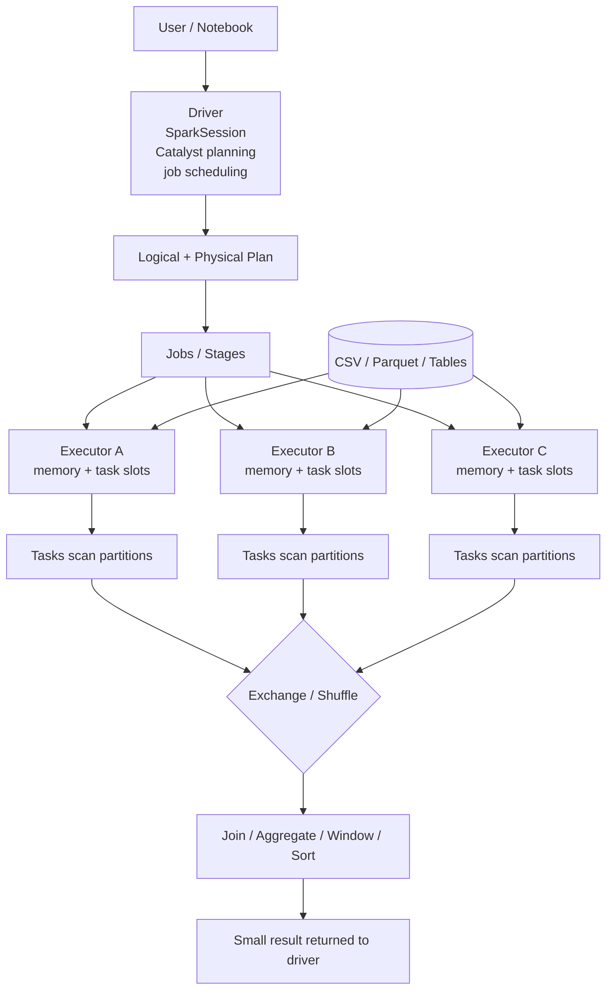
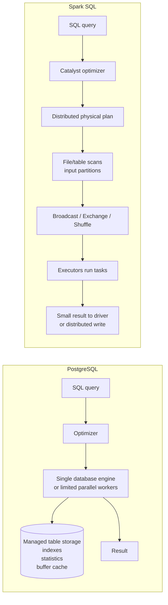

# Module 02 Session Handoff

**Updated:** June 28, 2026  
**Mode:** Trainer Mode  
**Module:** 02 — Spark SQL Fundamentals  
**Status:** Conceptually complete

## Resume instruction

Continue as a senior Spark SQL mentor. Ask one question at a time and let the
learner reason before explaining. The learner has completed Module 02
conceptually and should use a short mock interview only if a final assessment
gate is desired before moving on.

If resuming this course, start with a brief warm-up on explicit schemas,
window `PARTITION BY` keys, and `EXPLAIN FORMATTED` plan interpretation.

## Current position

The guided Spark SQL module is complete at a checkpoint-style score of 7.5/10.
The learner can explain Spark SQL execution, read physical plans, reason about
joins, aggregations, windows, exchanges, and compare Spark SQL with PostgreSQL.

Remaining optional work:

- Run the deferred Module 02 mock interview.
- Re-run the window notebook once, especially top-N-per-canton queries.
- Practice writing checkpoint SQL without notes when fresh.

## Key mental model

Spark SQL is not a separate database. It is a SQL interface over Spark's
distributed execution engine.

```text
SQL text
-> parsed logical plan
-> analyzed logical plan
-> optimized logical plan
-> physical plan
-> jobs, stages, tasks, scans, joins, shuffles, sorts
```

SQL describes the result. The Spark plan describes the data movement required
to compute it.

## Spark SQL architecture



Important vocabulary:

- **Driver:** builds plans, schedules work, tracks metadata, collects small
  results.
- **Executor:** JVM process that runs tasks and stores cached/shuffle/broadcast
  data.
- **Core / task slot:** how many tasks an executor can run concurrently.
- **Task:** unit of work, usually over one partition in a stage.
- **Exchange:** data movement across partitions, often a shuffle boundary.

## Spark SQL versus PostgreSQL



Same SQL can have very different performance because the systems have
different storage and execution models.

PostgreSQL usually optimizes over managed tables with indexes, statistics,
buffer cache, transactions, and a database-local executor.

Spark optimizes over distributed data using scans, partitions, broadcasts,
exchanges, shuffles, sorts, executor memory, and task parallelism.

## Concepts covered

- Reading CSV files creates DataFrame read plans; actions trigger execution.
- `printSchema()` mostly inspects metadata. `show()`, `count()`, writes, and
  collects are actions.
- Without explicit schemas or schema inference, CSV columns are usually read as
  strings.
- Explicit schemas avoid brittle implicit casts in numeric aggregations.
- Temporary views are session-scoped names over DataFrame plans, not persisted
  copied tables.
- `GROUP BY` often uses partial aggregation, `Exchange` by grouping key, then
  final aggregation.
- `AVG()` is physically computed from sum and count states.
- Broadcast hash join sends the smaller relation to executors so tasks can
  join locally.
- Sort-merge joins usually repartition both sides by the join key and sort both
  sides before joining.
- SQL window `PARTITION BY` defines logical analytical groups; it is not the
  same thing as Spark physical partitions.
- `ROW_NUMBER() OVER (PARTITION BY canton ORDER BY population DESC)` preserves
  rows and adds a rank. `GROUP BY canton` collapses rows.
- `ORDER BY` requires global ordering and may use range partitioning plus sort.
- `hashpartitioning(key)` groups equal keys together; useful for joins and
  aggregations.
- `rangepartitioning(order_col)` preserves ordered value ranges; useful for
  global ordering.
- `spark.sql.shuffle.partitions` controls the number of shuffle output
  partitions for SQL exchanges. It is separate from `defaultParallelism`.
- Too many shuffle partitions create tiny/empty task overhead. Too few reduce
  parallelism and can create large tasks.
- `SELECT *` is risky in Spark because wide rows make scans, joins, shuffles,
  sorts, spills, and driver transfers heavier.

## Essential plan patterns

Aggregation:

```text
Scan
-> HashAggregate partial
-> Exchange hashpartitioning(group_key)
-> HashAggregate final
```

Join with broadcast:

```text
Scan large side
Scan small side
-> BroadcastExchange small side
-> BroadcastHashJoin
```

Join without broadcast:

```text
Scan left
-> Exchange hashpartitioning(join_key)
-> Sort
Scan right
-> Exchange hashpartitioning(join_key)
-> Sort
-> SortMergeJoin
```

Window top-N per group:

```text
Scan
-> Sort by group key and order key
-> WindowGroupLimit partial
-> Exchange hashpartitioning(group_key)
-> Sort
-> WindowGroupLimit final
-> Window row_number
-> Filter rank <= N
```

Global order:

```text
Exchange rangepartitioning(order_key)
-> Sort
```

## Common debugging playbook

### CSV columns are strings

Symptom:

- `ReadSchema` shows numeric fields as `string`.
- `EXPLAIN` shows `cast(column AS double)` inside aggregates.

Check:

```python
df.printSchema()
```

Fix:

- Use explicit `StructType` schemas for contract fields.
- Use `inferSchema=True` only for quick exploration.

### Join returns more rows than expected

Symptom:

- Joined row count is larger than the base table.

Check:

```sql
SELECT COUNT(*), COUNT(DISTINCT municipality_id)
FROM accessibility_scores;

SELECT municipality_id, COUNT(*) AS records
FROM accessibility_scores
GROUP BY municipality_id
HAVING COUNT(*) > 1;
```

Fix:

- Deduplicate or aggregate right-side tables before joining.
- Confirm expected relationship: one-to-one, one-to-many, or many-to-many.

### Query has too many tiny tasks

Symptom:

- Plan shows `hashpartitioning(..., 200)` for tiny data.
- Spark UI shows many tiny/empty tasks.

Check:

```python
spark.conf.get("spark.sql.shuffle.partitions")
spark.sparkContext.defaultParallelism
```

Fix:

- For local tiny datasets, lower `spark.sql.shuffle.partitions`.
- For production, size partitions based on data volume, cluster cores, skew,
  and shuffle size.

### Slow join

Symptom:

- Plan shows multiple `Exchange` nodes and `SortMergeJoin`.

Check:

- Are both sides large?
- Is one side small enough to broadcast after filters/projection?
- Are join keys duplicated?
- Are join keys skewed?
- Are unnecessary columns carried through the join?

Fix:

- Project needed columns before the join.
- Filter early.
- Validate key cardinality.
- Let Spark broadcast genuinely small lookup tables, or hint only when you know
  the memory trade-off.

### Expensive global order

Symptom:

- Plan shows `Exchange rangepartitioning(...)` and `Sort`.

Check:

- Does the consumer need a total global order?
- Is a top-N enough?
- Is a per-group ranking enough?

Fix:

- Use `ORDER BY ... LIMIT N` for global top-N when appropriate.
- Use window functions for top-N per group.
- Avoid sorting wide rows.

### Window query gives rank 1 for every row

Symptom:

- `ROW_NUMBER()` returns `1` everywhere.

Likely cause:

```sql
PARTITION BY municipality_id
```

when each municipality appears once.

Fix:

- Partition by the business group, for example:

```sql
PARTITION BY canton
ORDER BY population DESC, municipality_id ASC
```

### `SELECT *` makes a plan heavy

Symptom:

- Wide rows flow through `Exchange`, `Join`, or `Sort`.

Check:

- Look for `Project` nodes and output columns in `EXPLAIN FORMATTED`.

Fix:

- Select only required columns before expensive operators.
- Remember: projection reduces row width; filters reduce row count.

## Interview questions and snappy answers

### What is Spark SQL?

Spark SQL is SQL compiled into a distributed Spark plan. The SQL describes the
result; Spark decides the scans, joins, exchanges, aggregations, sorts, and
tasks needed to compute it.

### How is Spark SQL different from PostgreSQL?

PostgreSQL usually runs inside one database engine that owns table storage,
indexes, stats, and cache. Spark SQL runs over distributed data and pays
attention to partitions, task parallelism, broadcasts, shuffles, and executor
memory.

### What is a temporary view?

A temporary view is a session-scoped name for a DataFrame plan. It lets me use
SQL against that DataFrame, but it does not copy data into a durable table.

### When does Spark execute a SQL query?

Spark builds plans lazily. It executes when an action asks for results, such as
`show()`, `count()`, `collect()`, or a write.

### Why can schema inference be risky?

It is convenient, but it costs extra scanning and can infer types incorrectly.
For reliable pipelines, explicit schemas are better, especially for numeric
fields used in joins and aggregations.

### Why can `GROUP BY` require a shuffle?

Rows with the same grouping key may start in different partitions. Spark can
partially aggregate locally, but final aggregation needs same-key partials to
meet, so Spark inserts an `Exchange` by the grouping key.

### Why does Spark show partial and final aggregates?

Partial aggregation reduces data locally before network movement. Final
aggregation merges those compact partial states after the shuffle.

### What does `Exchange` mean in a plan?

Usually data movement. Spark is changing partitioning to satisfy an operator,
such as grouping by a key, joining by a key, or producing global ordering.

### Broadcast join versus sort-merge join?

Broadcast join sends the small side to each executor and avoids shuffling the
large side. Sort-merge join repartitions both sides by join key, sorts them,
and streams matching keys together. Broadcast is great when one side is truly
small; sort-merge is safer for large-to-large joins.

### How do you validate a join did not multiply rows?

Compare expected row counts with actual row counts, then check duplicate keys
on both sides using `COUNT(*)` versus `COUNT(DISTINCT key)` and `GROUP BY key
HAVING COUNT(*) > 1`.

### What is the difference between SQL window `PARTITION BY` and Spark
physical partitions?

Window `PARTITION BY` defines logical groups for the analytic function.
Spark physical partitions are execution chunks. Spark may repartition by the
window key to compute the result, but the concepts are not identical.

### Why is `ROW_NUMBER()` different from `GROUP BY`?

`GROUP BY` collapses rows into one output row per group. `ROW_NUMBER()` keeps
the original row-level detail and adds a rank within each logical group.

### Why add a tie-breaker to `ROW_NUMBER()`?

Without a full ordering, tied rows can be ranked arbitrarily. Add a stable
tie-breaker like `municipality_id` to make results deterministic.

### Why is `ORDER BY` expensive in Spark?

Global ordering requires coordination across partitions. Spark often range
partitions by the order key and sorts, which can move and spill data.

### Why is `SELECT *` dangerous in Spark?

It carries wide rows through scans, joins, shuffles, sorts, and possibly driver
collection. Narrow rows are cheaper to move, sort, and join.

### What do you inspect first in `EXPLAIN FORMATTED`?

I look for scans, pushed filters, projections, join strategy, aggregate stages,
`Exchange` nodes, sorts, windows, and whether AQE is involved. I focus first on
where data is moved or globally ordered.

### How would you explain this module in one sentence?

Spark SQL feels like normal SQL, but the engineering skill is reading the
distributed physical plan: where Spark scans, moves, joins, sorts, aggregates,
and returns data.

## Learner strengths

- Strong understanding of Spark SQL as distributed execution, not just SQL
  syntax.
- Good instinct to inspect row counts, duplicate keys, and physical plans.
- Comfortable reasoning about `Exchange`, broadcast joins, partial/final
  aggregation, and global sort cost.
- Responds well to corrections and quickly repaired the key window-function
  mistake.

## Reinforcement needed

- Keep explicit schemas as the default for CSV work.
- Be careful with window `PARTITION BY`; choose the business grouping key, not
  merely a unique row identifier.
- Write checkpoint SQL slowly enough to avoid missing `FROM`, duplicate `ON`,
  or incomplete selected metrics.
- Continue separating projection from filtering: projection reduces width,
  filtering reduces row count.

## Suggested next warm-up

Ask:

> You need the top 3 municipalities by property value per canton, including
> accessibility score and POI count. What SQL would you write, and what
> physical Spark plan shape do you expect?

Expected answer should mention joins, projection, key-cardinality validation,
window `PARTITION BY canton`, sorting by property value with a deterministic
tie-breaker, possible broadcast joins, exchange by canton, window ranking, and
filtering to rank <= 3.
